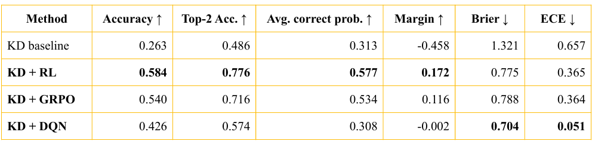

# Knowledge distillation (KD) project scaffold for VS Code + Colab

This project is the **first stage only**: train a student language model with **knowledge distillation (KD)** using L = α L<sub>CE</sub> + (1-α)L<sub>KD</sub> with:
- L<sub>CE</sub> = -ln p<sub>S</sub>(y<sub>true</sub>), 
- L<sub>KD</sub> = T<sup>2</sup> KL(p<sub>T</sub><sup>T</sup>||p<sub>S</sub><sup>T</sup>)

where:
- `P_T` = teacher distribution
- `P_S` = student distribution
- `alpha` = CE/KD balance (default: `0.5`)

The code is written so that:
- you can **edit the project in VS Code**,
- and run the heavy training in **Google Colab**.

## Project structure

```text
kd_qwen_project/
├─ README.md
├─ requirements.txt
├─ data/
│  ├─ toy_train.jsonl
│  └─ toy_valid.jsonl
└─ src/
   ├─ __init__.py
   ├─ data.py
   ├─ losses.py
   ├─ model_utils.py
   └─ train_kd.py
```

## Training stages

### Stage 1 - Knowledge Distillation

The student model is first trained on instruction-style prompt/response data.

Supported formats:

#### Option A: prompt/response
```json
{"prompt": "Explain KL divergence in simple words.", "response": "KL divergence measures how different one probability distribution is from another."}
```

#### Option B: instruction/input/output
```json
{"instruction": "Explain KL divergence in simple words.", "input": "", "output": "KL divergence measures how different one probability distribution is from another."}
```
The script computes CE and KD **only on the assistant/response tokens**.

### Stage 2 - Post-training

The trained KD student is then used as the common starting point for RL, GRPO, and DQN experiments on CommonsenseQA.
- Input: question + 5 answer options
- Action: A / B / C / D / E
- Reward: 1 for correct, 0 for wrong

## Recommended first model pair

Use teacher and student from the **same family**:
- Teacher: `Qwen/Qwen2.5-1.5B-Instruct`
- Student: `Qwen/Qwen2.5-0.5B-Instruct`

That avoids tokenizer/vocabulary mismatch.

## Local development in VS Code

Install dependencies in a virtual environment:

```bash
pip install -r requirements.txt
```

You can test the pipeline with the toy dataset.

## Colab training workflow

1. Upload this folder to Colab or clone your repo.
2. Enable GPU.
3. Install requirements:

```bash
pip install -r requirements.txt
```

4. Run training:

```bash
python -m src.train_kd \
  --train_file data/toy_train.jsonl \
  --valid_file data/toy_valid.jsonl \
  --teacher_model Qwen/Qwen2.5-1.5B-Instruct \
  --student_model Qwen/Qwen2.5-0.5B-Instruct \
  --output_dir outputs/kd_run \
  --alpha 0.5 \
  --max_length 512 \
  --per_device_batch_size 1 \
  --gradient_accumulation_steps 8 \
  --num_epochs 1 \
  --learning_rate 2e-5 \
  --teacher_4bit
```

## Important notes

### 1. Same-family teacher and student
This code assumes teacher and student share the same tokenizer/vocabulary layout.
That is why Qwen → Qwen is the best first setup.

### 2. Teacher is frozen
The teacher is used only to produce distributions for the KD term.
Only the student is updated.

### 3. Teacher 4-bit quantization
Use `--teacher_4bit` in Colab to reduce memory.
The student stays trainable in standard precision.

### 4. If memory is still tight
Lower these first:
- `max_length`
- `per_device_batch_size`
- raise `gradient_accumulation_steps`

The next practical memory-saving step would be student LoRA/QLoRA, but this project intentionally keeps the first KD version simple.

## Main command-line arguments

- `--train_file`: path to JSONL training file
- `--valid_file`: path to JSONL validation file
- `--teacher_model`: HF model name/path for teacher
- `--student_model`: HF model name/path for student
- `--output_dir`: where checkpoints and metrics are saved
- `--alpha`: KD/CE balance in `L = alpha * CE + (1-alpha) * KD`
- `--max_length`: max sequence length
- `--per_device_batch_size`: batch size per step
- `--gradient_accumulation_steps`: gradient accumulation
- `--num_epochs`: number of epochs
- `--learning_rate`: AdamW learning rate
- `--teacher_4bit`: load teacher in 4-bit
- `--max_train_samples`: optional debug cap
- `--max_valid_samples`: optional debug cap

## What gets saved

In `output_dir` the script saves:
- `best_model/` if validation is used
- `final_model/`
- `tokenizer/`
- `train_config.json`
- `history.json`

## Next step after this KD scaffold

Once KD works, the clean next branch is:
- `KD only`
- `KD + REINFORCE`

That way the RL stage starts from a student that is already distilled.

## Results
<p align="center">
   
</p>

1. **RL** gave the strongest accuracy-based performance. It achieved the highest accuracy, top-2 accuracy, average correct probability, and margin.
2. **GRPO** was a competitive second-best method. It clearly improved over the KD baseline, but it did not surpass RL on this task.
3. **DQN** was not the best for raw accuracy, but it was the best-calibrated method. It had the best ECE and Brier score, which means its confidence estimates were much more reliable. DQN is the best choice when confidence quality and selective reliability matter

**The final trade-off is:**
● RL is the best choice for maximum accuracy.
● DQN is the best choice when confidence quality and selective reliability matter.
● GRPO stays close to RL, but does not outperform it in this setting

